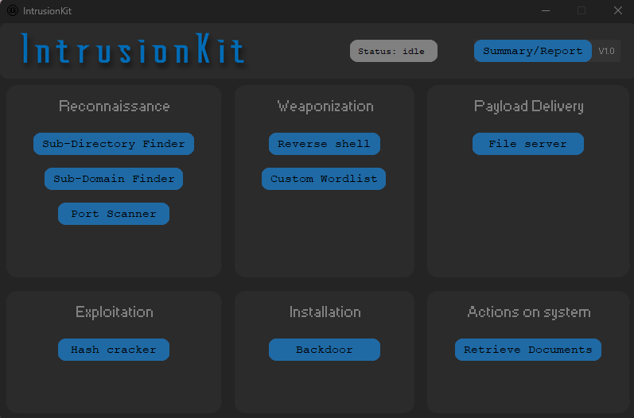
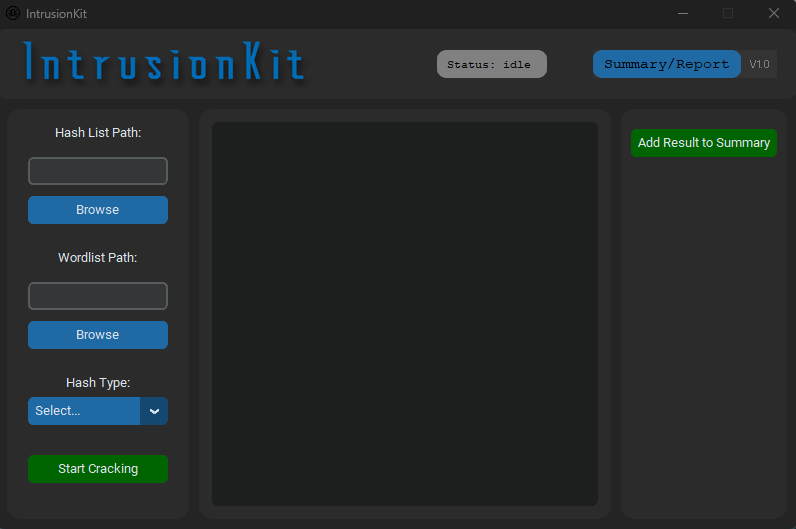
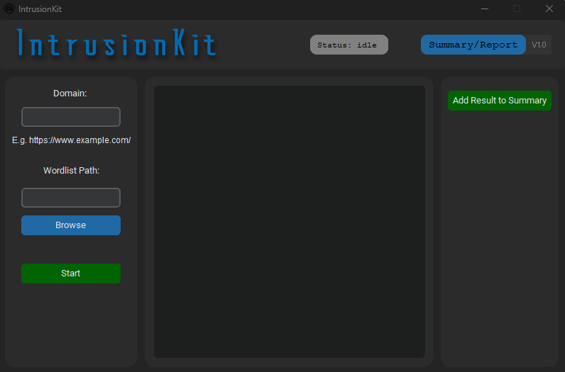
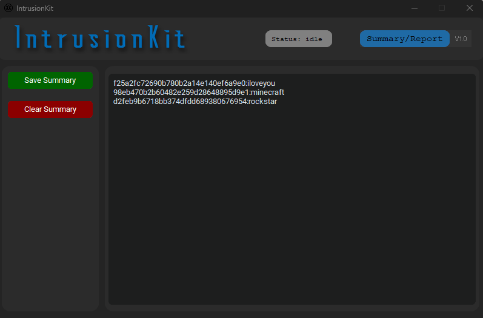

# IntrusionKit Toolkit

[](https://www.python.org/downloads/release/python-3114/) 
 


IntrusionKit is a penetration testing toolkit based on Lockheed Martins Cyber Kill Chain.The Toolkit is made to be usefull for both complete beginners aswell as experienced penetration testers


## Menu Preview


## Hash Cracker Preview


## SubDirectory Finder Preview


## Summary Preview



## Install & Dependence
  ```
  pip install -r requirements.txt
  ```


## Use
  ```
  python menu.py
  ```


 ## Information
- Author:  `Stian Skjoerestad Mikkelsen`


## Details
### Tested Platform
- software
  ```
  OS: Windows 11 (09/02/2023)
  Python: 3.11.4
  ```


